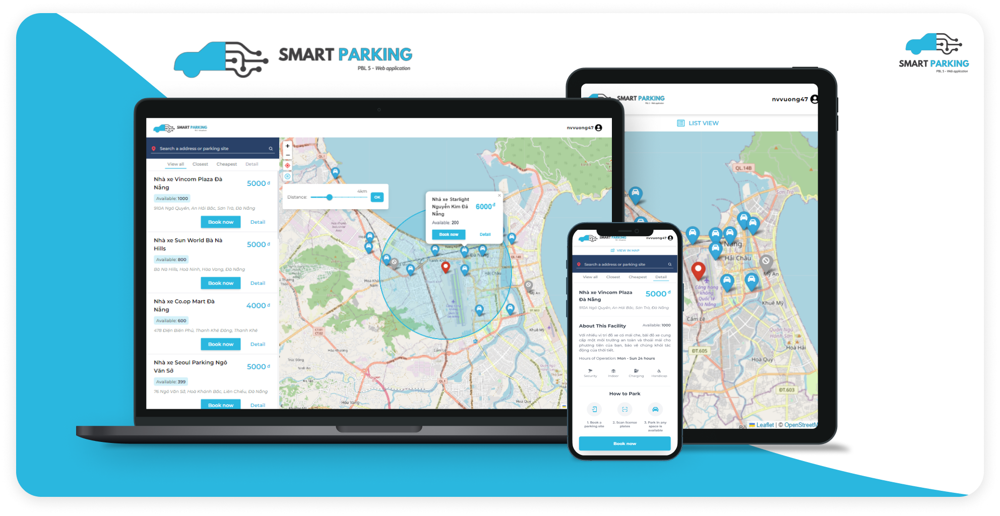

# Smart Parking - PBL5 Wep Application

## Usage

1. Open the website https://smartparkingpbl5.netlify.app/ in your browser.
2. Please note that the website may take a few seconds to load the API data from the server.
3. Make sure to allow the website to use your location in order to find parking sites near you.
   If your browser prompts you to allow or deny location access, please select "Allow".

